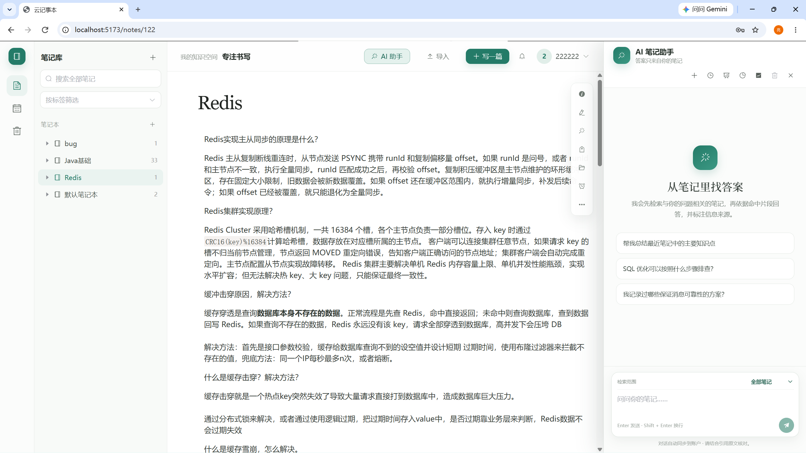
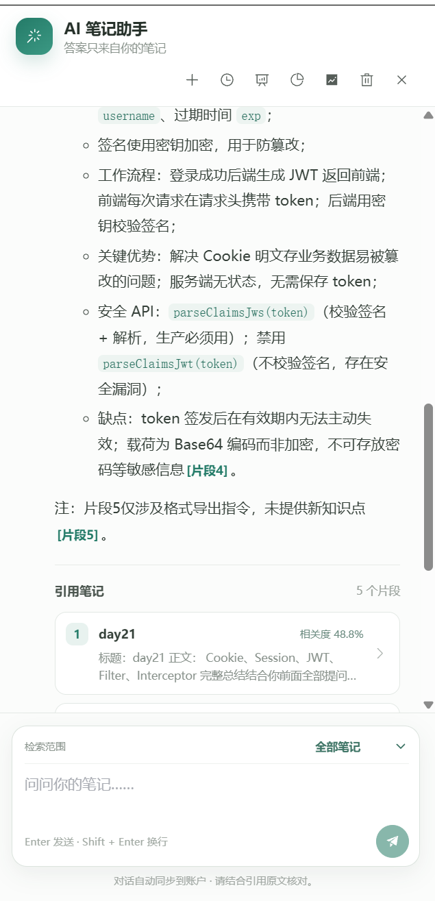
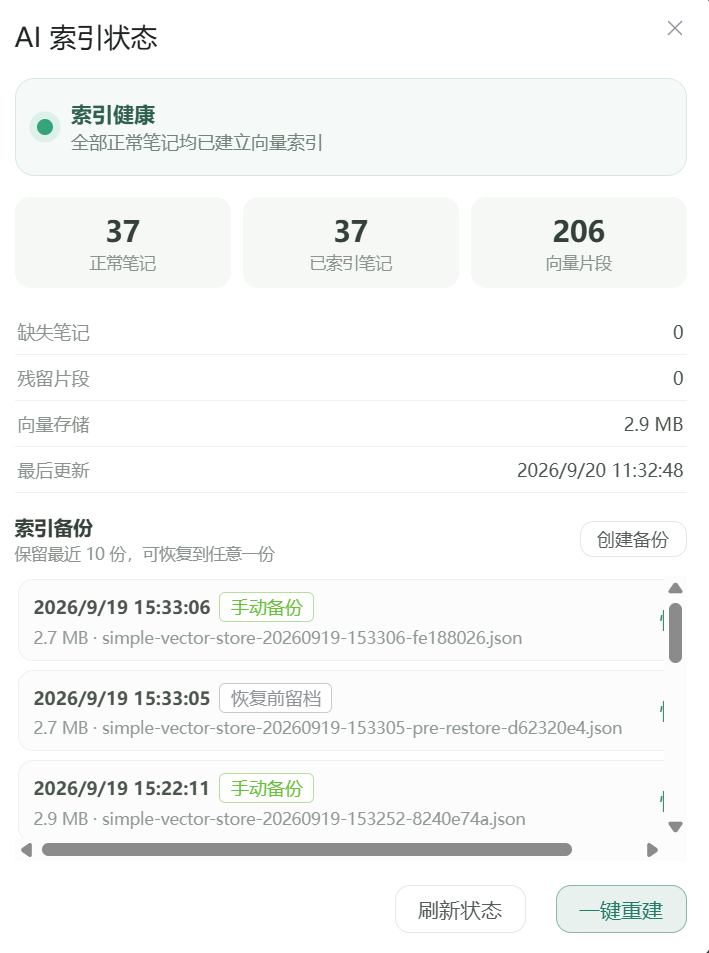

# 云记事本（CloudNotepad）

[](https://github.com/dawskjdnawkj/notepad-ai/actions/workflows/ci.yml)

一个可部署上线的多用户云记事本，内置 **检索增强（RAG）的 AI 助手**：能基于你自己的笔记流式问答并给出引用来源，还能让 AI 直接改写笔记（预览确认后才写回，可一键恢复原文）。

## 在线演示

**http://47.242.4.27:8082** —— 演示账号 `222222` / `222222`（登录页可点击自动填入）

> 部署在一台 1.6G 内存的阿里云服务器上，与另一个项目共存。为了塞进去，JVM 参数、容器内存上限、Tomcat 线程数都做过针对性裁剪，详见 [部署上线指南](./docs/05-部署上线指南.md)。

## 界面

| 笔记编辑 | AI 问答（带引用溯源） |
|---|---|
|  |  |



## 功能

### 笔记

- **富文本编辑**：标题/正文自动保存（700ms 防抖 + 串行保存队列），断网或误关页面时草稿落在 localStorage，下次打开自动恢复
- **组织方式**：笔记本分组、标签、置顶、分页搜索
- **全文搜索**：MySQL `ngram` 全文索引，中文分词可用
- **回收站**：软删除 + 30 天自动清理，支持恢复
- **日历视图**、**定时提醒**（站内通知 + 邮件）
- **图片上传**：魔数探测 + 扩展名一致性 + Content-Type 三重校验，落盘名为 UUID

### AI 助手（RAG）

- **索引与检索**：笔记切块后向量化，检索结果按用户过滤，不会串到别人的笔记
- **流式问答**：SSE 逐字返回，附带**引用来源**（可点击跳转到原笔记）
- **会话与反馈**：多会话历史，答案可点赞/点踩
- **回归评测**：把反馈沉淀成评测用例，跑基线对比，量化检索质量变化
- **AI 编辑笔记**：摘要 / 润色 / 续写 / 提取待办四种能力。**先流式生成预览，用户确认后才写回**，写回前保存原文快照，支持一键回退
- **索引管理**：索引状态、全量重建、增量同步（编辑后 5 秒防抖）、备份/恢复/校验
- **向量存储可切换**：默认进程内 `SimpleVectorStore`，可切到 `pgvector`（见 [迁移对比报告](./docs/07-pgvector迁移对比报告.md)）

### 工程化

这些不是 CRUD，是这个项目里真正花时间去啃的部分：

- **登录失败限流**：按「用户名+IP」和「单 IP」两个维度原子计数，锁定优先于验密，不存在的用户名同样计数（不留账号枚举信号）
- **JWT 服务端吊销**：token 带版本号，登出/改密码/重置密码后旧 token 立即失效，不用等 7 天有效期
- **全链路追踪**：每个请求一个 `requestId`，日志里带 `event=` 结构化字段，出问题能直接按 id 捞
- **AI 并发许可守恒**：全局 + 单用户双层限流，并且有断言保证「活跃数 + 可用数 == 上限」，许可泄漏测得出来
- **索引原子保存与损坏恢复**：写入走临时文件 + 原子替换，保留多份备份，索引损坏时可回退
- **7 个端到端验收脚本**（`backend/scripts/verify-*.sh`）：每个特性配一个可复跑的验收脚本，覆盖限流、吊销、并发许可、索引恢复、pgvector 迁移等
- **45 个单元测试 + GitHub Actions CI**：全部 Mock 掉数据库、模型调用与邮件，不烧额度也不需要真实环境，任何人在本地 `mvn test` 都能复现

## 测试

```bash
cd backend && mvn test          # 45 个单元测试，约 2 秒
cd notepadweb && npm run build  # 类型检查 + 生产构建
```

CI（[.github/workflows/ci.yml](./.github/workflows/ci.yml)）跑的就是这两条，不配任何密钥。

单测和端到端脚本的分工：

| | 单元测试 | `verify-*.sh` |
|---|---|---|
| 依赖 | 无（全部 Mock） | 真实数据库、服务进程、**百炼 API Key** |
| 能进 CI | ✅ | ❌ |
| 覆盖 | 限流边界与并发、JWT 版本号与存量兼容、登录编排顺序、提醒标题截断、验证码回收 | 全链路真实行为 |

两者互补：单测保证改了 A 不坏 B，端到端脚本保证线上真的跑得通。

## 技术栈

| 层 | 选型 |
|---|---|
| 后端 | Spring Boot 3.3 · Java 17 · MyBatis-Plus · MySQL 8 · jjwt · Knife4j |
| AI | Spring AI Alibaba（百炼 DashScope）· SimpleVectorStore / pgvector |
| 前端 | Vue 3 · Vite · TypeScript · Pinia · Element Plus · wangEditor |
| 部署 | Docker Compose · Nginx |

## 本地运行

1. 用 MySQL 8 执行 [`sql/init.sql`](./sql/init.sql)；已有库按序号执行 [`sql/upgrade/`](./sql/upgrade) 中尚未应用的脚本
2. 配置下列环境变量（缺任何一个都会因占位符无法解析而启动失败）：

   ```
   DB_USERNAME / DB_PASSWORD / JWT_SECRET
   AI_DASHSCOPE_API_KEY / MAIL_USERNAME / MAIL_PASSWORD
   ```

3. 启动后端：`cd backend && mvn spring-boot:run`，接口文档在 http://localhost:8080/doc.html
4. 启动前端：`cd notepadweb && npm install && npm run dev`，地址 http://localhost:5173

> 联调提示：登录失败限流的计数在进程内存里，本地反复试密码被锁的话重启后端即可解锁；
> 也可以把 `NOTEPAD_AUTH_LOGIN_ATTEMPT_MAX_PER_IP` 调大（本地所有请求 IP 都是 `127.0.0.1`，会跨测试账号累计）。

## 构建与部署

```bash
cd backend    && mvn clean package -DskipTests   # 产物：target/*.jar
cd notepadweb && npm run build                   # 产物：dist/
```

部署编排、Nginx 配置与踩过的坑都在 [部署上线指南](./docs/05-部署上线指南.md)。

**增量脚本与 jar 的上线顺序不能反**：先执行 SQL，再换 jar。

## 设计文档

| 文档 | 内容 |
|---|---|
| [01-需求分析](./docs/01-需求分析.md) | 需求背景与用例 |
| [02-数据库设计](./docs/02-数据库设计.md) | 表结构、索引、状态机 |
| [03-接口设计](./docs/03-接口设计.md) | 全部接口约定、错误码、前端联调约定 |
| [04-前端开发指南](./docs/04-前端开发指南.md) | 前端结构与约定 |
| [05-部署上线指南](./docs/05-部署上线指南.md) | 打包、上传、上线顺序、常见坑 |
| [06-需求规格说明书](./docs/06-需求规格说明书.md) | 需求规格 |
| [07-pgvector迁移对比报告](./docs/07-pgvector迁移对比报告.md) | 两种向量存储的实测对比 |

## 已知限制

写在这里而不是等人问出来：

- **限流计数在进程内存**，重启即清零、多实例不共享 —— 需要多实例时换 Redis 计数
- **token 吊销是用户级而非会话级** —— 任一设备登出或改密码后，该账号所有设备都要重新登录；要做到「单设备登出」需要引入 `jti` 黑名单
- **向量索引是全局单例**，一份 `simple-vector-store.json` 服务所有用户，所以索引的备份/恢复是运维操作而非用户操作 —— 这几个接口只对 `NOTEPAD_INDEX_ADMIN_USERNAMES` 配置的账号开放，默认不开放
- **规模未验证** —— 一切都在几十篇笔记、单活跃用户下验过，没有做压测
- **前端没有测试** —— 后端有 45 个单元测试，前端目前只有 `vue-tsc` 的类型检查兜底，没有组件测试；UI 逻辑（自动保存、路由切换、AI 流式渲染）仍然靠人工验证，这次开发中确实漏过两个只有实际操作才会暴露的问题

---

上传图片通过登录态保护；前端访问 `/api` 和 `/uploads` 时由 Vite 或生产环境反向代理转发到后端。
