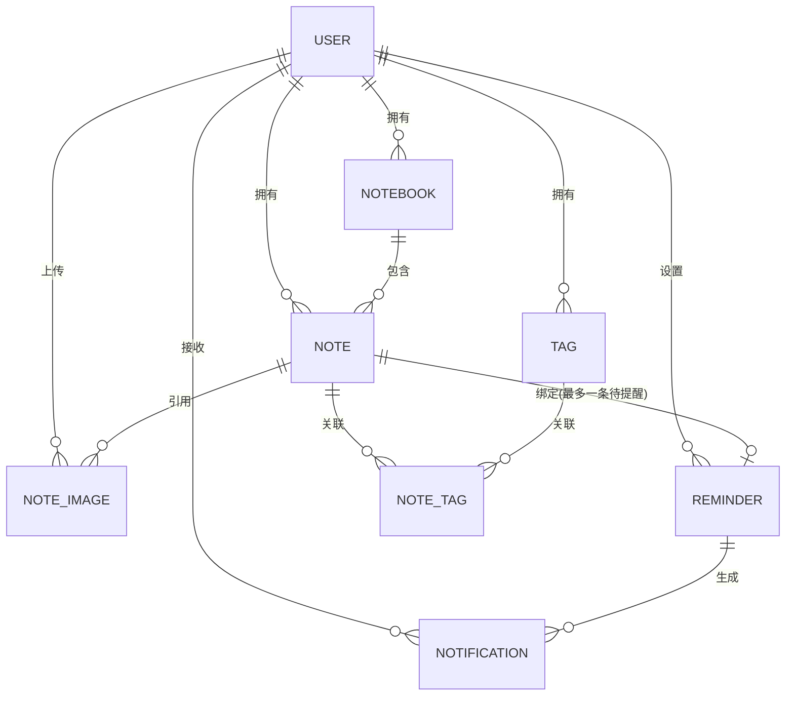

# 云记事本 数据库设计

| 项目 | 内容 |
| --- | --- |
| 文档版本 | v1.0（已同步至实际实现） |
| 编写日期 | 2026-08-12（v1.0 更新于 2026-08-14） |
| 对应需求 | [01-需求分析.md](./01-需求分析.md) |
| 数据库 | cloud_notepad（MySQL 8.0+） |
| 建表脚本 | [../sql/init.sql](../sql/init.sql) |
| 变更脚本 | [../sql/upgrade/](../sql/upgrade/)（增量迁移） |

---

## 1. 设计约定

- 数据库：`cloud_notepad`，字符集 `utf8mb4`，排序规则 `utf8mb4_general_ci`；
- 引擎：全部使用 InnoDB；
- 主键：`BIGINT UNSIGNED` 自增。单机部署规模足够，不引入分布式 ID（如雪花）；
- 时间字段：统一 `DATETIME`；`create_time` 默认当前时间，`update_time` 用 `ON UPDATE CURRENT_TIMESTAMP` 自动维护；
- 逻辑删除：业务表统一带 `deleted TINYINT NOT NULL DEFAULT 0`（0 正常 / 1 删除），实体上使用 MyBatis-Plus `@TableLogic`；**note 表的 `deleted` 同时承担"回收站标记"**；`note_image`、`note_tag`、`reminder`、`notification` 等按需带或不带 `deleted`；
- **不建物理外键**：使用"逻辑外键 + 索引"（关联字段），级联规则由应用层控制，避免锁开销、便于后续演进（如分库分表）；
- 命名：表名、字段名统一小写下划线；
- 数据隔离：所有业务查询都以 `user_id` 作为第一条件，保证用户之间数据完全隔离。

---

## 2. 实体关系总览



| 表名 | 用途 | 说明 |
| --- | --- | --- |
| user | 用户 | 注册、登录、登录态归属 |
| notebook | 笔记本 | 笔记的分类容器 |
| note | 笔记 | 核心业务表 |
| tag | 标签 | 用户级标签（可挂多篇笔记） |
| note_tag | 笔记-标签关联 | 多对多中间表 |
| note_image | 笔记图片 | 富文本正文引用的图片（独立磁盘存储） |
| reminder | 提醒 | 定时提醒设置与状态 |
| notification | 通知 | 站内通知中心 |

> 登录态（Token）不建表：使用 JWT 无状态认证，前端保存 Token；服务端不持久化会话。

---

## 3. 表设计明细

### 3.1 user 用户表

| 字段 | 类型 | 可空 | 默认 | 说明 |
| --- | --- | --- | --- | --- |
| id | BIGINT UNSIGNED | 否 | 自增 | 主键 |
| username | VARCHAR(32) | 否 | - | 用户名，唯一 |
| password | VARCHAR(100) | 否 | - | 密码（BCrypt 密文） |
| nickname | VARCHAR(32) | 是 | NULL | 昵称 |
| avatar | VARCHAR(255) | 是 | NULL | 头像地址（预留） |
| email | VARCHAR(64) | 是 | NULL | 邮箱（注册必填，用于验证码注册 / 找回 / 修改密码） |
| status | TINYINT | 否 | 1 | 1 正常 / 0 禁用 |
| token_version | INT | 否 | 0 | JWT 版本号：登出 / 改密码时 +1，使已签发的旧 token 立即失效 |
| create_time | DATETIME | 否 | 当前时间 | 注册时间 |
| update_time | DATETIME | 否 | 当前时间 | 更新时间 |
| deleted | TINYINT | 否 | 0 | 逻辑删除 |

索引：

- `PRIMARY KEY (id)`
- `UNIQUE uk_username (username)`
- `UNIQUE uk_email (email)`

设计要点：

- 密码只存 BCrypt 密文，禁止明文；
- 注册时必须提供邮箱并通过验证码校验；`email` 列保留 NULL 以兼容早期无邮箱账号；
- **注册成功后由应用层自动创建该用户的"默认笔记本"**（notebook.is_default = 1）。

### 3.2 notebook 笔记本表

| 字段 | 类型 | 可空 | 默认 | 说明 |
| --- | --- | --- | --- | --- |
| id | BIGINT UNSIGNED | 否 | 自增 | 主键 |
| user_id | BIGINT UNSIGNED | 否 | - | 所属用户 → user.id |
| name | VARCHAR(50) | 否 | - | 笔记本名称（同一用户下唯一） |
| is_default | TINYINT | 否 | 0 | 1 默认笔记本（不可重命名/删除） |
| create_time | DATETIME | 否 | 当前时间 | 创建时间 |
| update_time | DATETIME | 否 | 当前时间 | 更新时间 |
| deleted | BIGINT | 否 | 0 | 逻辑删除：0 正常 / 删除时间戳（epoch 秒），见下方说明 |

索引：

- `PRIMARY KEY (id)`
- `UNIQUE uk_user_name (user_id, name, deleted)`
- `KEY idx_user_id (user_id)`

> **为什么 `deleted` 是时间戳而不是 0/1**：唯一键把 `deleted` 收了进来，软删之后名字才能被重新创建。如果 `deleted` 只有 0/1 两个取值，两行已删除的同名记录会撞键，用户删掉「工作」之后就再也建不了「工作」了。其他表（`user`/`note`/`note_image`）的 `deleted` 仍是 0/1，因为它们没有「同名唯一」的约束。详见 `sql/upgrade/013_soft_delete_unique_key.sql`。

设计要点：

- 名称唯一性用联合唯一索引（user_id + name）保证，不依赖应用层判断；
- 删除笔记本时，其下所有笔记由应用层一并移入回收站（见第 4 节级联矩阵）。

### 3.3 note 笔记表（核心表）

| 字段 | 类型 | 可空 | 默认 | 说明 |
| --- | --- | --- | --- | --- |
| id | BIGINT UNSIGNED | 否 | 自增 | 主键 |
| user_id | BIGINT UNSIGNED | 否 | - | 所属用户 → user.id |
| notebook_id | BIGINT UNSIGNED | 否 | - | 所属笔记本 → notebook.id |
| title | VARCHAR(200) | 否 | '' | 标题（可为空，后端自动取正文前 50 字） |
| content | MEDIUMTEXT | 是 | NULL | 正文（**富文本 HTML**，应用层限制 100 万字符） |
| content_text | MEDIUMTEXT | 是 | NULL | 正文纯文本（HTML 剥离后，**搜索用**） |
| pinned | TINYINT | 否 | 0 | 置顶：0 否 / 1 是 |
| delete_time | DATETIME | 是 | NULL | 移入回收站时间，30 天自动清空依据 |
| create_time | DATETIME | 否 | 当前时间 | 创建时间（**日历标记依据**） |
| update_time | DATETIME | 否 | 当前时间 | 最后编辑时间（自动保存刷新） |
| deleted | TINYINT | 否 | 0 | 0 正常 / 1 回收站（逻辑删除） |

索引：

- `PRIMARY KEY (id)`
- `KEY idx_user_create (user_id, create_time)`
- `KEY idx_user_update (user_id, update_time)`
- `KEY idx_user_notebook (user_id, notebook_id)`
- `KEY idx_user_delete_time (user_id, delete_time)`
- `KEY idx_notebook_id (notebook_id)`
- `FULLTEXT ft_title_content (title, content) WITH PARSER ngram`（**遗留索引，见 4.4 说明**）

设计要点：

- `content` 存富文本 HTML（wangEditor 所见即所得产物），非 Markdown；
- `content_text` 由应用层在保存时用 `stripHtml(content)` 自动生成：剥离 HTML 标签、还原 `&nbsp;`/`&lt;`/`&gt;`/`&amp;`/`&quot;` 等实体、合并空白。**只用于搜索与预览，不用于展示**；
- `pinned` 置顶标记：列表查询 `ORDER BY pinned DESC, update_time DESC`；
- `deleted` 兼任"回收站标记"：0 正常、1 回收站；**彻底删除才是物理 DELETE**；
- 恢复笔记时若原笔记本已删除，应用层改绑"默认笔记本"；
- 日历视图依赖 `idx_user_create`：查某月有笔记的日期 → `SELECT DISTINCT DATE(create_time) ... WHERE user_id=? AND create_time BETWEEN 月初 AND 月末 AND deleted=0`。

### 3.4 tag 标签表

| 字段 | 类型 | 可空 | 默认 | 说明 |
| --- | --- | --- | --- | --- |
| id | BIGINT UNSIGNED | 否 | 自增 | 主键 |
| user_id | BIGINT UNSIGNED | 否 | - | 所属用户 → user.id |
| name | VARCHAR(30) | 否 | - | 标签名称（同一用户下唯一） |
| create_time | DATETIME | 否 | 当前时间 | 创建时间 |
| update_time | DATETIME | 否 | 当前时间 | 更新时间 |
| deleted | BIGINT | 否 | 0 | 逻辑删除：0 正常 / 删除时间戳（epoch 秒），同 notebook |

索引：

- `PRIMARY KEY (id)`
- `UNIQUE uk_user_name (user_id, name, deleted)`
- `KEY idx_user_id (user_id)`

设计要点：

- 标签是**用户级**的（一个标签可挂多篇笔记），不随单篇笔记删除；
- 删除标签时，应用层同步删除 note_tag 中的关联记录。

### 3.5 note_tag 笔记-标签关联表

| 字段 | 类型 | 可空 | 默认 | 说明 |
| --- | --- | --- | --- | --- |
| id | BIGINT UNSIGNED | 否 | 自增 | 主键 |
| note_id | BIGINT UNSIGNED | 否 | - | 笔记ID → note.id |
| tag_id | BIGINT UNSIGNED | 否 | - | 标签ID → tag.id |
| create_time | DATETIME | 否 | 当前时间 | 关联时间 |

索引：

- `PRIMARY KEY (id)`
- `UNIQUE uk_note_tag (note_id, tag_id)`
- `KEY idx_tag_id (tag_id)`

设计要点：

- **无 `deleted` 字段**：关联记录没有逻辑删除场景，直接物理删除；
- 笔记进入回收站时**保留**标签关联，恢复后标签自动回来；
- 彻底删除笔记时，应用层同步物理删除该笔记的 note_tag 记录。

### 3.6 reminder 提醒表

| 字段 | 类型 | 可空 | 默认 | 说明 |
| --- | --- | --- | --- | --- |
| id | BIGINT UNSIGNED | 否 | 自增 | 主键 |
| user_id | BIGINT UNSIGNED | 否 | - | 所属用户 → user.id |
| note_id | BIGINT UNSIGNED | 否 | - | 被提醒的笔记 → note.id |
| remind_at | DATETIME | 否 | - | 提醒时间（由 N 分钟/小时/天换算） |
| status | TINYINT | 否 | 0 | 0 待提醒 / 1 已提醒 / 2 已取消 |
| notified_at | DATETIME | 是 | NULL | 实际生成通知的时间 |
| create_time | DATETIME | 否 | 当前时间 | 创建时间 |
| update_time | DATETIME | 否 | 当前时间 | 更新时间 |

索引：

- `PRIMARY KEY (id)`
- `KEY idx_status_remind (status, remind_at)`
- `KEY idx_note_id (note_id)`
- `KEY idx_user_id (user_id)`

设计要点：

- **无 `deleted` 字段**：状态机流转即可覆盖（取消 = status 置 2），保留历史记录；
- 一个笔记**同时最多一条"待提醒"**：设置新提醒前，应用层先把旧的待提醒置为已取消（应用层约束，不建特殊索引）；
- 提醒时间由 `unit`（`MINUTES`/`HOURS`/`DAYS`）+ `value`（1~43200）换算，应用层 `LocalDateTime.now().plusMinutes/Hours/Days(value)`；
- 笔记移入回收站 → 待提醒置为已取消；恢复后不自动恢复，需用户重新设置；
- 定时任务（每分钟）：查 `status=0 AND remind_at <= NOW()`，逐个置为已提醒、写 notified_at、插入一条 notification。

### 3.7 notification 通知表

| 字段 | 类型 | 可空 | 默认 | 说明 |
| --- | --- | --- | --- | --- |
| id | BIGINT UNSIGNED | 否 | 自增 | 主键 |
| user_id | BIGINT UNSIGNED | 否 | - | 接收用户 → user.id |
| type | TINYINT | 否 | 1 | 通知类型：1 提醒（预留更多类型） |
| title | VARCHAR(100) | 否 | - | 通知标题 |
| content | VARCHAR(500) | 否 | - | 通知内容 |
| note_id | BIGINT UNSIGNED | 是 | NULL | 关联笔记（点击跳转；笔记被彻底删除后跳转失效） |
| is_read | TINYINT | 否 | 0 | 0 未读 / 1 已读 |
| read_time | DATETIME | 是 | NULL | 阅读时间 |
| create_time | DATETIME | 否 | 当前时间 | 创建时间 |

索引：

- `PRIMARY KEY (id)`
- `KEY idx_user_read (user_id, is_read, create_time)`

设计要点：

- 通知只增不删；保留策略（如 90 天清理）列为 P1；
- 点击通知跳转笔记：若笔记已彻底删除，前端提示"笔记已删除"。

### 3.8 note_image 笔记图片表

| 字段 | 类型 | 可空 | 默认 | 说明 |
| --- | --- | --- | --- | --- |
| id | BIGINT UNSIGNED | 否 | 自增 | 主键 |
| user_id | BIGINT UNSIGNED | 否 | - | 上传用户 → user.id |
| note_id | BIGINT UNSIGNED | 是 | NULL | 所属笔记 → note.id（**临时图片为空**） |
| url | VARCHAR(500) | 否 | - | 访问 URL（相对路径，`/uploads/` 前缀） |
| file_name | VARCHAR(255) | 否 | - | 磁盘相对路径（删除文件用） |
| original_name | VARCHAR(255) | 是 | NULL | 原始文件名 |
| size | BIGINT | 否 | 0 | 文件大小（字节） |
| create_time | DATETIME | 否 | 当前时间 | 上传时间 |
| deleted | TINYINT | 否 | 0 | 逻辑删除 |

索引：

- `PRIMARY KEY (id)`
- `KEY idx_user_note (user_id, note_id)`
- `KEY idx_url (url)`

设计要点：

- 图片以**独立磁盘文件**存储，`content` 中只保存 `url`（``），**不使用 base64**；
- 粘贴/上传截图即调用上传接口写入一条 `note_image`，此时 `note_id` 为空（临时图片）；笔记首次创建或更新时，应用层解析正文中的 url 并把对应图片 `note_id` 回填绑定；
- 一张图片只归属一篇笔记，暂不做多笔记复用；
- 彻底删除笔记 / 清空回收站 / 30 天自动清空时，应用层删除对应磁盘文件并逻辑删除记录；
- 孤儿图片（长时间 `note_id` 为空）由定时任务每天清理。

---

## 4. 关键设计决策

### 4.1 回收站实现

回收站 = `note.deleted = 1` + `note.delete_time`：

- 移入回收站：`deleted=1`、`delete_time=NOW()`；
- 恢复：`deleted=0`、`delete_time=NULL`；原笔记本已删除则改绑默认笔记本；
- 彻底删除：物理 DELETE 笔记 + 物理 DELETE 对应 note_tag + 删除图片（note_image 与磁盘文件）；
- 自动清空：定时任务每天扫描 `deleted=1 AND delete_time < NOW()-30天`，物理删除。

> MyBatis-Plus 提示：`@TableLogic` 会让标准查询自动过滤 `deleted=1`，**回收站列表、恢复、自动清空需要用自定义 SQL**（Mapper 里手写），不要用标准 selectById/updateById。

### 4.2 删除级联矩阵（应用层保证）

| 操作 | 影响 |
| --- | --- |
| 删除笔记本 | 其下笔记全部移入回收站（deleted=1、delete_time=NOW()）；待提醒取消 |
| 笔记移入回收站 | 待提醒取消（status=2）；note_tag 关联保留；图片保留 |
| 恢复笔记 | deleted=0；原笔记本已删除则改绑默认笔记本；标签自动恢复 |
| 彻底删除笔记 | 物理删除 note、note_tag、note_image（及磁盘文件）；通知记录保留（跳转时提示已删除） |
| 清空回收站 | 物理删除所有回收站笔记及关联 note_tag、note_image |
| 删除标签 | 物理删除 note_tag 关联 |

### 4.3 提醒生命周期

```text
设置提醒（待提醒 status=0，remind_at = now + N 分钟/小时/天）
    │
    ├── 到期 → 定时任务 → status=1、notified_at、生成 notification（未读）
    │
    ├── 用户取消 / 笔记进回收站 → status=2
    │
    └── 已提醒后再次设置 → 插入新的待提醒记录
```

### 4.4 搜索实现（已从全文索引改为纯文本列）

- 正文以 HTML 存储，直接 `LIKE` 会命中标签文本，故新增 `content_text` 纯文本列，保存时剥离 HTML 生成；
- 搜索语句：`WHERE user_id=? AND deleted=0 AND (title LIKE '%kw%' OR content_text LIKE '%kw%')`，叠加笔记本/标签/日期筛选；
- **`content_text` 无索引**：`LIKE '%...%'` 前缀通配无法走 B-tree 索引，MVP 单用户笔记量下性能可接受；
- 原方案中的 `FULLTEXT ft_title_content (title, content)` 为 Markdown 时代的遗留索引，**当前代码已不再使用**，可在下次变更脚本中删除（或数据量增长后评估引入 Elasticsearch，P2）；
- 搜索语句必须带 `user_id` 条件缩小范围。

### 4.5 图片生命周期

```text
上传图片 → 写 note_image(note_id = NULL) + 存磁盘文件
    │
    ├── 保存笔记 → 解析 content 中的 url → 回填 note_id 绑定
    │
    ├── 笔记进回收站 → 图片保留（恢复后可继续使用）
    │
    ├── 彻底删除笔记 / 清空回收站 / 30 天自动清空 → 删磁盘文件 + 逻辑删除记录
    │
    └── 孤儿图片（note_id 长期为空）→ 定时任务每天清理
```

---

## 5. 数据量预估与索引对照

目标规模：总用户数千级，单用户笔记 ≤ 10 万条（总量百万级以内，单机 MySQL 完全可支撑）。

| 查询场景 | SQL 形态 | 使用索引 |
| --- | --- | --- |
| 笔记本列表 | `WHERE user_id=? AND deleted=0 ORDER BY create_time DESC` | idx_user_id |
| 笔记列表（置顶+最后编辑排序） | `WHERE user_id=? AND deleted=0 ORDER BY pinned DESC, update_time DESC` | idx_user_update |
| 按笔记本筛选 | `WHERE user_id=? AND notebook_id=? AND deleted=0` | idx_user_notebook |
| 日历标记（某月有笔记的日期） | `SELECT DISTINCT DATE(create_time) WHERE user_id=? AND create_time BETWEEN 月初 AND 月末 AND deleted=0` | idx_user_create |
| 当天创建的笔记 | `WHERE user_id=? AND create_time BETWEEN 当天0点 AND 次日0点 AND deleted=0` | idx_user_create |
| 回收站列表 / 30 天清空 | `WHERE user_id=? AND deleted=1 ORDER BY delete_time DESC` | idx_user_delete_time |
| 全文搜索 | `WHERE user_id=? AND deleted=0 AND (title LIKE '%kw%' OR content_text LIKE '%kw%')` | 无（LIKE 前缀通配，见 4.4） |
| 提醒扫描（每分钟） | `WHERE status=0 AND remind_at<=NOW() LIMIT 100` | idx_status_remind |
| 通知列表 / 未读数 | `WHERE user_id=? AND is_read=? ORDER BY create_time DESC` | idx_user_read |
| 图片绑定 / 清理 | `WHERE user_id=? AND note_id=?` / `WHERE note_id IS NULL AND create_time < ?` | idx_user_note |

---

## 6. 建表脚本

完整可执行脚本见 [../sql/init.sql](../sql/init.sql)，MySQL 8 环境直接执行：

```bash
mysql -uroot -p < sql/init.sql
```

已上线/存量库的增量变更统一放入 `sql/upgrade/` 目录：

| 脚本 | 内容 |
| --- | --- |
| 001_note_image.sql | 新增 note_image 表 |
| 002_note_image_add_deleted.sql | note_image 增加 deleted 逻辑删除列 |
| 003_note_add_content_text.sql | note 增加 content_text 纯文本列 |
| 004_note_add_pinned.sql | note 增加 pinned 置顶列 |

---

## 7. 预留与演进

- 登录态：JWT 无状态认证，不建表；如需服务端强制下线，可引入 Redis 黑名单（P1）；
- note 预留：多端编辑冲突的版本记录（P1，可选）；
- user 预留：`nickname`、`avatar` 字段已建，后续可做个人资料页；
- notification 保留策略：90 天清理（P1）；
- 搜索演进：数据量明显增长后（单用户 10 万+笔记、LIKE 变慢），再评估 Elasticsearch（P2）；
- 表结构变更：禁止直接改生产表，新增变更脚本统一放入 `sql/upgrade/` 目录并记录。
