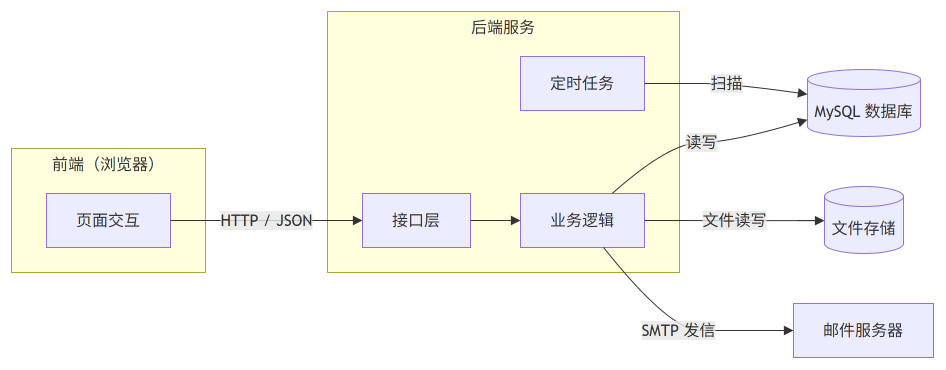
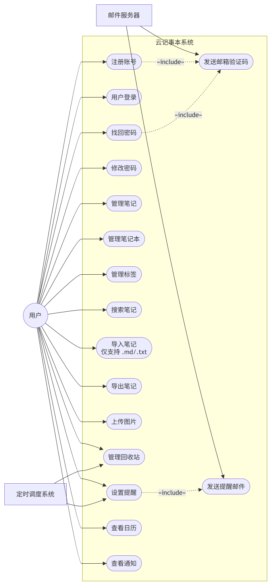
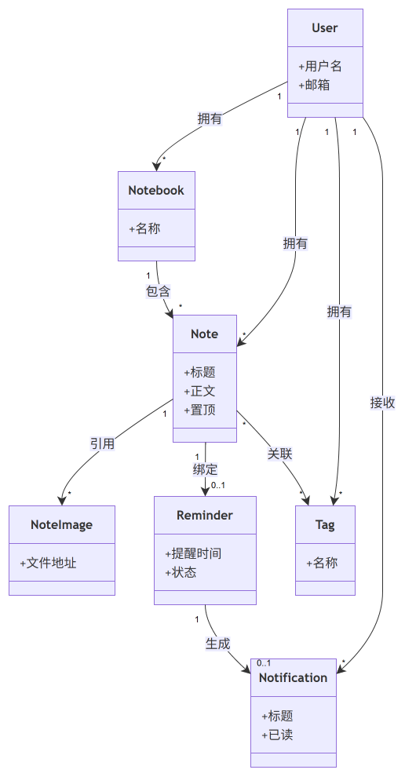
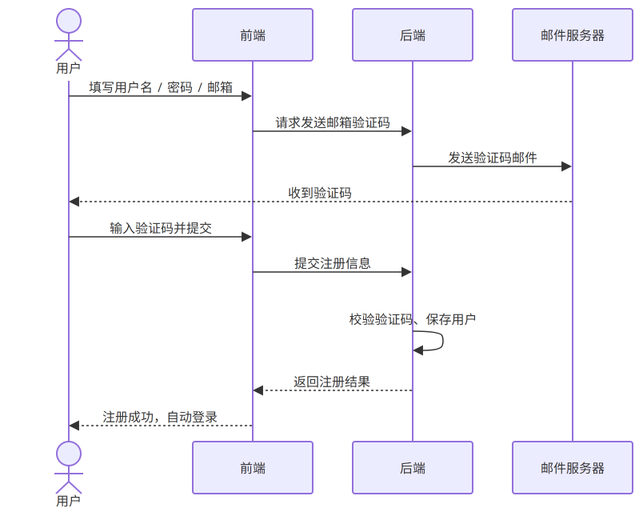
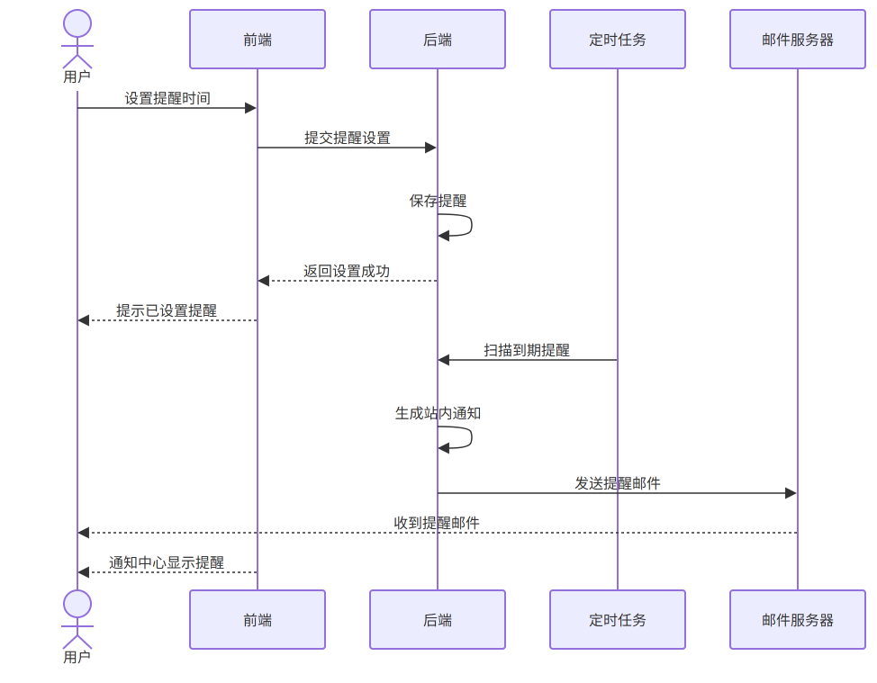
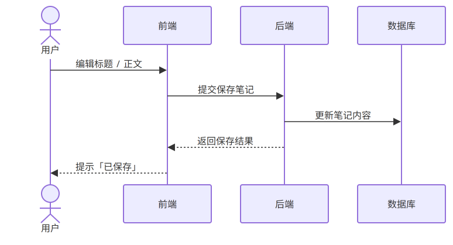
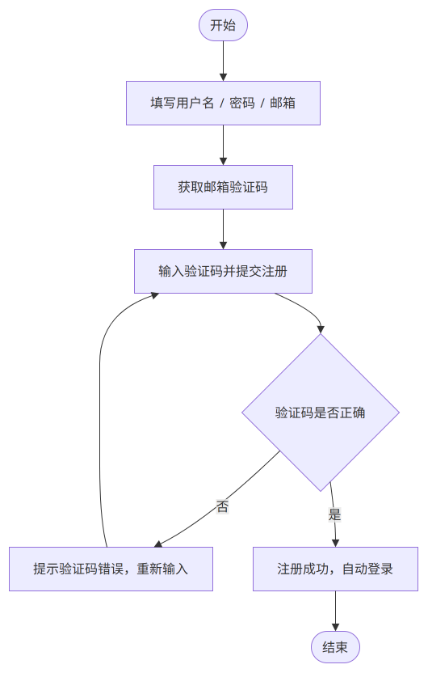
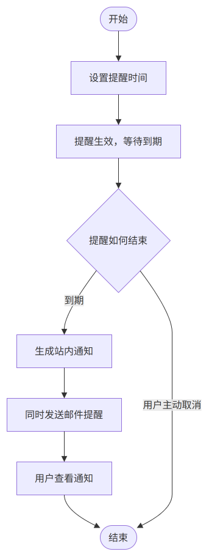
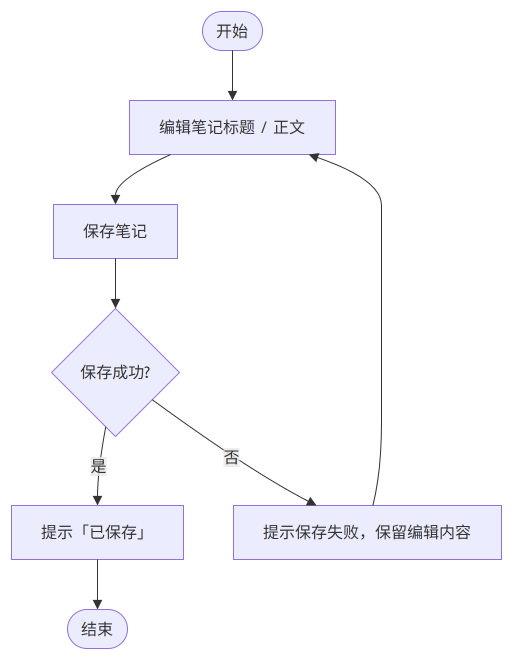

# 云记事本（CloudNotepad）系统

## 软件需求规格说明书（SRS）

**Software Requirements Specification（SRS）**

---

| 项目 | 内容 |
| --- | --- |
| 文档编号 | SRS-NOTEPAD-2026-001 |
| 版本号 | V1.0 |
| 密级 | 公开 |
| 编制人 | （待填写） |
| 编制人学号 | （待填写） |
| 测试人 | （待填写） |
| 测试人学号 | （待填写） |
| 班级 | （待填写） |
| 批准日期 | 2026 年 8 月 17 日 |

---

## 目录

1 引言
　1.1 编写目的
　1.2 项目背景
　1.3 术语和缩写
　1.4 参考资料

2 系统总体描述
　2.1 系统概述
　2.2 系统目标

3 经典场景
　3.1 健忘用户的「闹钟式」提醒场景

4 系统角色

5 系统用例模型
　5.1 用例清单
　5.2 系统用例图
　5.3 用例关系说明

6 用例规约
　6.1 UC-01 注册账号
　6.2 UC-02 登录
　6.3 UC-03 笔记编辑与自动保存
　6.4 UC-04 设置提醒
　6.5 UC-05 提醒到期生成通知
　6.6 UC-06 搜索笔记
　6.7 UC-07 回收站恢复笔记

7 系统类模型
　7.1 类图
　7.2 类关系说明

8 系统交互模型（时序图）
　8.1 时序图 1：注册（邮箱验证码）
　8.2 时序图 2：设置提醒与到期触发通知
　8.3 时序图 3：笔记编辑与自动保存

9 系统行为模型（活动图）
　9.1 核心业务流程
　9.2 活动图 1：注册流程
　9.3 活动图 2：提醒生命周期
　9.4 活动图 3：笔记自动保存

10 非功能需求

11 测试用例
　11.1 测试人员
　11.2 测试用例表

12 项目效果
　12.1 系统主界面
　12.2 笔记编辑
　12.3 日历视图
　12.4 提醒与通知

13 总结

14 查重报告

---

# 1 引言

## 1.1 编写目的

本文档对「云记事本（CloudNotepad）系统」（以下简称「本系统」）进行需求定义与规格说明，用于课程设计验收与评审。文档依据真实代码逆向分析生成，聚焦核心功能，UML 关系均有代码依据，未虚构功能。

## 1.2 项目背景

当前市面上多数好用、具备实时同步能力的记事本应用（如印象笔记、Notion 等）均需付费订阅，个人用户使用门槛较高；同时，作者在日常学习与工作中常因健忘而遗漏待办事项——即便写下了任务计划书，也常忘记在合适的时间查看。核心能力：

1. **云端同步**——数据保存在服务端，任意设备登录即同步，可免费自部署；
2. **定时提醒**——笔记可设置 N 分钟/小时/天后提醒，像闹钟一样到期生成站内通知；
3. **日历视图**——按创建日期浏览笔记，快速回看某天记录；
4. **回收站**——软删除 + 30 天自动清理，误删可找回。

## 1.3 术语和缩写

| 术语 | 说明 |
| --- | --- |
| SRS | 软件需求规格说明书（Software Requirements Specification） |
| JWT | JSON Web Token，无状态登录鉴权凭证 |
| BCrypt | 密码单向散列加密算法 |
| LWW | Last-Write-Wins，最后写入者胜出的并发编辑策略 |
| content_text | 正文剥离 HTML 后的纯文本列，用于搜索 |
| 回收站 | 笔记软删除后的暂存区，支持恢复与彻底删除 |

## 1.4 参考资料

1. GB/T 9385-2008《计算机软件需求规格说明规范》
2. GB/T 8567-2006《计算机软件文档编制规范》
3. Spring Boot 官方文档（https://spring.io/projects/spring-boot）
4. MyBatis-Plus 官方文档（https://baomidou.com）
5. 项目仓库内文档：《01-需求分析.md》《02-数据库设计.md》《03-接口设计.md》

---

# 2 系统总体描述

## 2.1 系统概述

本系统为 B/S 架构的前后端分离 Web 应用，由四个部分组成：

| 模块 | 技术栈 | 职责 |
| --- | --- | --- |
| 前端应用 | Vue 3 + Vite 5 + TypeScript + Pinia + Element Plus | 记事本 UI、富文本编辑（wangEditor 5）、自动保存、日历、通知中心 |
| 后端服务 | Spring Boot 3.3 + MyBatis-Plus 3.5 + JWT | REST API、JWT 鉴权、业务逻辑、定时任务 |
| 数据存储 | MySQL 8.0 | 用户/笔记本/笔记/标签/提醒/通知等持久化 |
| 文件存储 | 服务器磁盘（uploads/） | 富文本正文引用的图片存储 |
| 邮件服务 | QQ SMTP | 发送邮箱验证码 |

图 2-1 系统架构图

## 2.2 系统目标

1. 满足个人日常记笔记需求：笔记本分类、标签、全文搜索、回收站找回；
2. 提供差异化功能：日历视图（按日期浏览笔记）与定时提醒（N 分钟/小时/天后提醒查看笔记）；
3. 数据存服务端，天然实现多端同步，且可免费自部署。

---

# 3 经典场景

## 3.1 健忘用户的「闹钟式」提醒场景

**场景背景**：许多用户（学生、上班族）经常在笔记里写下任务计划或灵感，但因为健忘，事后往往忘了在合适的时间回看，导致计划落空。传统记事本只能记录，无法主动提醒。

**场景故事**：学生小明用云记事本记录下周要交的课程设计计划，写下「周三前完成数据库设计、周五前完成接口联调」等几条笔记。小明给「数据库设计」这条笔记设置了「2 天后提醒」。两天后，小明打开网页，顶部通知角标出现未读小红点——点开通知中心，一条「提醒：数据库设计——该查看你的笔记了」的通知排在首位，点击后直接跳转到那条笔记。小明照此逐一推进任务，不再遗漏。全程数据保存在云端，换台电脑登录依然能看到同样的笔记和提醒。

**场景目标**：说明系统解决的核心问题——让记事本既能记录，又能像闹钟一样在设定时间主动提醒用户回看，弥补用户的健忘。

**参与角色**：用户、定时调度系统、邮件服务器（注册阶段）。

**场景结果**：笔记云端同步；设置提醒后到期生成站内通知；点击通知直达笔记；日历可回溯某天记录。

---

# 4 系统角色

本系统有账号体系，采用「登录用户 + 两个系统参与者」的角色模型：

| 角色 | 类型 | 职责 |
| --- | --- | --- |
| 用户 | 主 Actor（人） | 注册/登录、创建与编辑笔记、分类打标签、搜索、设置提醒、查看通知、管理回收站 |
| 邮件服务器 | 外部系统 Actor | 发送注册/找回/修改密码的邮箱验证码 |
| 定时调度系统 | 系统 Actor | 每分钟扫描到期提醒生成通知、30 天自动清理回收站、清理孤儿图片 |

说明：「创建者」「参与者」等概念在本系统中不存在——所有用户权限相同，不区分角色。

---

# 5 系统用例模型

## 5.1 用例清单

| 编号 | 用例 | 参与者 | 优先级 |
| --- | --- | --- | --- |
| UC-01 | 注册账号 | 用户、邮件服务器 | 高 |
| UC-02 | 登录 | 用户 | 高 |
| UC-03 | 笔记编辑与自动保存 | 用户 | 高 |
| UC-04 | 设置提醒 | 用户 | 高 |
| UC-05 | 提醒到期生成通知 | 定时调度系统 | 高 |
| UC-06 | 搜索笔记 | 用户 | 高 |
| UC-07 | 回收站恢复笔记 | 用户 | 中 |
| UC-08 | 找回密码 | 用户、邮件服务器 | 中 |
| UC-09 | 管理笔记本 | 用户 | 中 |
| UC-10 | 管理标签 | 用户 | 中 |
| UC-11 | 上传图片 | 用户 | 中 |
| UC-12 | 查看日历 | 用户 | 中 |
| UC-13 | 查看通知 | 用户 | 中 |

> 注：UC-01～UC-07 为核心用例，均给出详细用例规约（第 6 章）；UC-08～UC-13 的规则见第 2 章及《01-需求分析.md》。

## 5.2 系统用例图

图 5-1 系统用例图

## 5.3 用例关系说明

| 关系 | 用例 | 说明 | 代码依据 |
| --- | --- | --- | --- |
| include | 注册账号 include 发送邮箱验证码 | 注册流程必然校验邮箱验证码 | AuthController.sendCode / UserServiceImpl.register |
| include | 找回密码 include 发送邮箱验证码 | 找回密码必然先发送验证码 | AuthController（reset-code / reset） |
| include | 修改密码 include 发送邮箱验证码 | 修改密码必然先发送验证码 | AuthController（change-code / change） |
| 关联 | 用户与所有用例 | 用户与用例之间为实线关联，表示用户发起并参与该用例 | 用例图中用户→各用例实线 |
| 关联 | 邮件服务器与发送邮箱验证码 | 邮件服务器作为外部系统参与发送验证码 | MailService.sendCode（QQ SMTP） |
| 关联 | 定时调度系统与设置提醒 | 定时任务扫描到期提醒并生成通知 | ReminderTask（@Scheduled 每分钟） |

说明：本系统用例图中，用户与各用例之间采用实线关联（无箭头），表示用户发起并参与该用例；「注册账号」「找回密码」「修改密码」与「发送邮箱验证码」之间采用 include 关系（虚线箭头 `..>`），表示用例间的必然包含。本系统未使用泛化与 extend 关系——「提醒到期生成通知」不建模为独立用户用例，而是定时调度系统的系统行为（见 UC-05）。

---

# 6 用例规约

## 6.1 UC-01 注册账号

| 字段 | 内容 |
| --- | --- |
| 用例编号 | UC-01 |
| 用例名称 | 注册账号 |
| 参与者 | 用户、邮件服务器 |
| 用例目标 | 创建用户账号，注册成功后自动登录 |
| 前置条件 | 用户进入注册页，未登录 |
| 后置条件 | 账号创建成功，签发 JWT 自动登录，系统创建「默认笔记本」 |
| 触发条件 | 用户点击「获取验证码」并提交注册表单 |
| 基本事件流 | 1. 用户输入用户名、邮箱、密码；2. 系统校验格式（用户名 3~20 位、密码 6~20 位、邮箱合法）；3. 系统通过 SMTP 发送 6 位数字验证码；4. 用户输入验证码并提交；5. 系统校验验证码正确且未过期；6. 系统创建用户（密码 BCrypt 加密）并创建默认笔记本；7. 系统签发 JWT 并返回，用户自动登录 |
| 备选事件流 | 本地无任何预置内容，注册即全新账号 |
| 异常事件流 | 邮箱已被注册 → 提示「邮箱已被注册」（409）；验证码错误或过期 → 提示并停留在注册页；60 秒内重复发送验证码 → 提示「发送过于频繁」 |
| 业务规则 | 用户名 3~20 位（字母/数字/下划线）且全局唯一；邮箱格式合法且全局唯一；密码 6~20 位；验证码 6 位数字、5 分钟有效 |

## 6.2 UC-02 登录

| 字段 | 内容 |
| --- | --- |
| 用例编号 | UC-02 |
| 用例名称 | 登录 |
| 参与者 | 用户 |
| 用例目标 | 校验用户身份并签发 JWT |
| 前置条件 | 用户已注册 |
| 后置条件 | 登录成功，前端保存 JWT 并进入系统 |
| 触发条件 | 用户点击「登录」 |
| 基本事件流 | 1. 用户输入用户名、密码；2. 系统校验；3. 校验通过签发 JWT，返回 token 与用户信息；4. 前端保存 token 并跳转首页 |
| 备选事件流 | 前端刷新页面时通过 token 调用 `/api/auth/me` 恢复登录态 |
| 异常事件流 | 用户名或密码错误 → 统一提示「用户名或密码错误」（401），不暴露具体原因 |
| 业务规则 | JWT 无状态认证，服务端不持久化会话；token 过期或缺失返回 401 |

## 6.3 UC-03 笔记编辑与自动保存

| 字段 | 内容 |
| --- | --- |
| 用例编号 | UC-03 |
| 用例名称 | 笔记编辑与自动保存 |
| 参与者 | 用户 |
| 用例目标 | 创建/编辑笔记，内容实时保存至服务端 |
| 前置条件 | 用户已登录 |
| 后置条件 | 笔记内容保存成功，多端数据一致 |
| 触发条件 | 用户新建笔记或修改标题/正文 |
| 基本事件流 | 1. 用户新建笔记（可选笔记本，默认「默认笔记本」）；2. 用户用富文本编辑器编辑；3. 内容或标题变化即触发自动保存（串行队列）；4. 系统保存时剥离 HTML 生成 content_text、回填正文图片绑定；5. 保存成功前端提示「已保存」 |
| 备选事件流 | 粘贴/上传图片时先上传至服务器磁盘，正文只保存 URL；切走/卸载页面时强制落盘 |
| 异常事件流 | 保存失败 → 前端保留编辑内容并提示保存失败 |
| 业务规则 | 正文为富文本 HTML，单篇上限 100 万字符；标题可为空（自动取正文纯文本前 50 字）；多端同时编辑以最后保存为准（LWW） |

## 6.4 UC-04 设置提醒

| 字段 | 内容 |
| --- | --- |
| 用例编号 | UC-04 |
| 用例名称 | 设置提醒 |
| 参与者 | 用户 |
| 用例目标 | 为笔记设置定时提醒，到期生成通知 |
| 前置条件 | 用户已登录，笔记存在 |
| 后置条件 | 生成一条「待提醒」记录（remind_at = 当前时间 + N 分钟/小时/天） |
| 触发条件 | 用户在笔记上选择提醒时间并提交 |
| 基本事件流 | 1. 用户选择提醒单位（MINUTES/HOURS/DAYS）与数值；2. 系统将旧的「待提醒」置为已取消；3. 系统计算 remind_at 并写入新的待提醒记录；4. 返回提醒对象 |
| 备选事件流 | 重复设置自动覆盖旧的待提醒，无需先取消 |
| 异常事件流 | 参数不合法（value 超出 1~43200）→ 提示（400）；笔记不存在 → 404 |
| 业务规则 | 一个笔记同时最多一条「待提醒」；取消提醒（用户取消 / 笔记进回收站）状态置为已取消 |

## 6.5 UC-05 提醒到期生成通知

| 字段 | 内容 |
| --- | --- |
| 用例编号 | UC-05 |
| 用例名称 | 提醒到期生成通知 |
| 参与者 | 定时调度系统 |
| 用例目标 | 到期提醒生成站内通知，提醒用户查看笔记 |
| 前置条件 | 存在「待提醒」且 remind_at ≤ 当前时间的记录 |
| 后置条件 | 提醒置为「已提醒」，生成一条未读站内通知 |
| 触发条件 | 定时任务每分钟扫描 |
| 基本事件流 | 1. 定时任务扫描 `status=待提醒 AND remind_at<=NOW()`；2. 对每条记录置为已提醒、写入 notified_at；3. 插入一条 notification（标题=笔记标题，内容=「该查看你的笔记了」，关联 note_id） |
| 备选事件流 | 前端每 60 秒轮询未读数量，通知角标实时更新 |
| 异常事件流 | 笔记已彻底删除 → 通知保留，点击时前端提示「笔记已删除」 |
| 业务规则 | 通知只增不删；点击通知跳转对应笔记 |

## 6.6 UC-06 搜索笔记

| 字段 | 内容 |
| --- | --- |
| 用例编号 | UC-06 |
| 用例名称 | 搜索笔记 |
| 参与者 | 用户 |
| 用例目标 | 按关键词检索标题或正文匹配的笔记 |
| 前置条件 | 用户已登录 |
| 后置条件 | 返回匹配的笔记列表 |
| 触发条件 | 用户输入关键词搜索 |
| 基本事件流 | 1. 用户输入关键词；2. 系统按 `title LIKE '%kw%' OR content_text LIKE '%kw%'` 检索；3. 可叠加笔记本、标签筛选；4. 结果置顶优先、按最后编辑时间倒序、分页展示，关键词高亮 |
| 备选事件流 | 无关键词时按笔记列表/筛选展示 |
| 异常事件流 | 无结果 → 显示空列表 |
| 业务规则 | content_text 为保存时剥离 HTML 生成的纯文本列；MVP 用 LIKE 前缀通配，数据量增长后评估引入 Elasticsearch |

## 6.7 UC-07 回收站恢复笔记

| 字段 | 内容 |
| --- | --- |
| 用例编号 | UC-07 |
| 用例名称 | 回收站恢复笔记 |
| 参与者 | 用户 |
| 用例目标 | 将误删的笔记恢复至原笔记本 |
| 前置条件 | 回收站存在已删除笔记 |
| 后置条件 | 笔记恢复至原笔记本 |
| 触发条件 | 用户点击「恢复」 |
| 基本事件流 | 1. 用户打开回收站；2. 选择笔记点击「恢复」；3. 系统将 deleted 置 0、清空 delete_time |
| 备选事件流 | 原笔记本已被删除 → 恢复到「默认笔记本」 |
| 异常事件流 | 笔记不存在 → 404 |
| 业务规则 | 彻底删除才物理删除笔记及关联标签、图片；回收站笔记超 30 天自动彻底删除 |

---

# 7 系统类模型

## 7.1 类图

图 7-1 系统核心类图

## 7.2 类关系说明

| 关系 | 说明 | 代码依据 |
| --- | --- | --- |
| 关联（1—N） | User 与 Notebook/Note/Tag/NoteImage/Reminder/Notification | 各实体均有 `userId` 字段，MyBatis-Plus `@TableField` |
| 关联（1—N） | Notebook 与 Note | Note 有 `notebookId` |
| 关联（1—0..1） | Note 与 Reminder | 一个笔记最多一条「待提醒」，应用层覆盖旧提醒（ReminderServiceImpl） |
| 关联（1—N） | Note 与 NoteImage | 一张图片归属一篇笔记 |
| 多对多 | Note 与 Tag（经 NoteTag 中间表） | note_tag 表，保存笔记时整体覆盖 tagIds |
| 关联（1—0..1） | Reminder 与 Notification | 一条提醒到期生成一条通知（ReminderTask） |

说明：本系统领域模型为 8 个实体（User、Notebook、Note、Tag、NoteTag、NoteImage、Reminder、Notification），不建物理外键，采用「逻辑外键 + 索引」，级联规则由应用层控制（详见《02-数据库设计.md》）。

---

# 8 系统交互模型（时序图）

## 8.1 时序图 1：注册（邮箱验证码）

图 8-1 时序图：注册（邮箱验证码）

## 8.2 时序图 2：设置提醒与到期触发通知

图 8-2 时序图：设置提醒与到期触发通知

## 8.3 时序图 3：笔记编辑与自动保存

图 8-3 时序图：笔记编辑与自动保存

---

# 9 系统行为模型（活动图）

## 9.1 核心业务流程

本章以活动图描述核心业务流程，表达「用户与系统完成一个业务目标需要经过什么流程」，不描述代码调用细节。每个活动图均包含开始节点、用户行为、系统处理、判断节点、成功/失败分支与结束节点。

## 9.2 活动图 1：注册流程

图 9-1 活动图：注册流程

## 9.3 活动图 2：提醒生命周期

图 9-2 活动图：提醒生命周期

## 9.4 活动图 3：笔记自动保存

图 9-3 活动图：笔记自动保存

---

# 10 非功能需求

1. **性能**：单机、单用户笔记量 10 万以内，核心接口响应 < 500ms；列表接口统一分页（默认每页 20 条）；
2. **安全**：密码 BCrypt 加密存储；JWT 登录鉴权，全链路按 user_id 隔离数据；SQL 注入防护（MyBatis-Plus 参数化）；前端对渲染内容做 XSS 转义；访问他人数据统一返回 404；
3. **可靠性**：笔记实时自动保存，切走/卸载页面前强制落盘；回收站 + 30 天自动清理防误删；定时任务每分钟扫描保证提醒 1 分钟内触达；
4. **可用性**：响应式布局，多端登录数据一致（数据存服务端，登录即同步）。

---

# 11 测试用例

## 11.1 测试人员

- **测试人员 A**：负责用户核心（注册/登录、数据隔离、笔记自动保存、提醒设置与触发）。
- **测试人员 B**：负责搜索、回收站、日历、权限等模块。

测试人员签字：____________

## 11.2 测试用例表

### TC-A01 注册成功

| 项目 | 内容 |
| --- | --- |
| 测试编号 | TC-A01 |
| 测试时间 | 2026-XX-XX |
| 测试内容 | 注册账号（正常） |
| 测试人员 | 测试人员 A |
| 前置条件 | 使用未注册的用户名/邮箱 |
| 测试步骤 | 1. 输入合法用户名、邮箱、密码；2. 获取并填写正确验证码；3. 提交注册 |
| 预期结果 | 注册成功，自动登录并进入系统 |
| 实际结果 | 待实际测试填写 |
| 后置条件 | 账号创建成功，存在默认笔记本 |
| 测试结论 | 待实际测试填写 |

### TC-A02 注册验证码错误

| 项目 | 内容 |
| --- | --- |
| 测试编号 | TC-A02 |
| 测试时间 | 2026-XX-XX |
| 测试内容 | 注册（验证码错误） |
| 测试人员 | 测试人员 A |
| 前置条件 | 进入注册页 |
| 测试步骤 | 1. 输入合法信息；2. 填写错误验证码；3. 提交 |
| 预期结果 | 提示「验证码错误」，注册失败 |
| 实际结果 | 待实际测试填写 |
| 后置条件 | 无账号创建 |
| 测试结论 | 待实际测试填写 |

### TC-A03 登录成功

| 项目 | 内容 |
| --- | --- |
| 测试编号 | TC-A03 |
| 测试时间 | 2026-XX-XX |
| 测试内容 | 登录（正常） |
| 测试人员 | 测试人员 A |
| 前置条件 | 已注册账号 |
| 测试步骤 | 1. 输入正确用户名、密码；2. 点击登录 |
| 预期结果 | 返回 token，进入首页 |
| 实际结果 | 待实际测试填写 |
| 后置条件 | 登录态建立 |
| 测试结论 | 待实际测试填写 |

### TC-A04 数据隔离

| 项目 | 内容 |
| --- | --- |
| 测试编号 | TC-A04 |
| 测试时间 | 2026-XX-XX |
| 测试内容 | 用户数据隔离 |
| 测试人员 | 测试人员 A |
| 前置条件 | 用户 A、B 均已注册登录 |
| 测试步骤 | 1. 用户 A 请求用户 B 的笔记详情接口 |
| 预期结果 | 返回 404，无法访问他人数据 |
| 实际结果 | 待实际测试填写 |
| 后置条件 | 无数据泄露 |
| 测试结论 | 待实际测试填写 |

### TC-A05 笔记自动保存

| 项目 | 内容 |
| --- | --- |
| 测试编号 | TC-A05 |
| 测试时间 | 2026-XX-XX |
| 测试内容 | 笔记编辑与自动保存 |
| 测试人员 | 测试人员 A |
| 前置条件 | 已登录，新建一篇笔记 |
| 测试步骤 | 1. 编辑标题/正文；2. 观察自动保存；3. 刷新页面 |
| 预期结果 | 内容实时保存，提示「已保存」；刷新后内容一致 |
| 实际结果 | 待实际测试填写 |
| 后置条件 | 笔记内容持久化 |
| 测试结论 | 待实际测试填写 |

### TC-A06 设置提醒

| 项目 | 内容 |
| --- | --- |
| 测试编号 | TC-A06 |
| 测试时间 | 2026-XX-XX |
| 测试内容 | 设置提醒 |
| 测试人员 | 测试人员 A |
| 前置条件 | 已登录，某篇笔记存在 |
| 测试步骤 | 1. 打开笔记；2. 设置「30 分钟后」提醒 |
| 预期结果 | 返回提醒对象，状态「待提醒」，remind_at 正确 |
| 实际结果 | 待实际测试填写 |
| 后置条件 | 生成待提醒记录 |
| 测试结论 | 待实际测试填写 |

### TC-A07 提醒到期生成通知

| 项目 | 内容 |
| --- | --- |
| 测试编号 | TC-A07 |
| 测试时间 | 2026-XX-XX |
| 测试内容 | 提醒到期触发通知 |
| 测试人员 | 测试人员 A |
| 前置条件 | 存在 remind_at 到期的待提醒 |
| 测试步骤 | 1. 等待定时任务扫描（≤1 分钟） |
| 预期结果 | 提醒置为已提醒，通知中心出现未读通知 |
| 实际结果 | 待实际测试填写 |
| 后置条件 | 生成未读通知 |
| 测试结论 | 待实际测试填写 |

### TC-B01 全文搜索

| 项目 | 内容 |
| --- | --- |
| 测试编号 | TC-B01 |
| 测试时间 | 2026-XX-XX |
| 测试内容 | 全文搜索（正常） |
| 测试人员 | 测试人员 B |
| 前置条件 | 存在含关键词的笔记 |
| 测试步骤 | 1. 输入关键词搜索 |
| 预期结果 | 返回标题或正文匹配的笔记，关键词高亮 |
| 实际结果 | 待实际测试填写 |
| 后置条件 | 结果正确 |
| 测试结论 | 待实际测试填写 |

### TC-B02 回收站恢复（原笔记本已删）

| 项目 | 内容 |
| --- | --- |
| 测试编号 | TC-B02 |
| 测试时间 | 2026-XX-XX |
| 测试内容 | 回收站恢复（原笔记本已删除） |
| 测试人员 | 测试人员 B |
| 前置条件 | 笔记在回收站，原笔记本已删除 |
| 测试步骤 | 1. 打开回收站；2. 恢复该笔记 |
| 预期结果 | 笔记恢复到「默认笔记本」 |
| 实际结果 | 待实际测试填写 |
| 后置条件 | 笔记恢复正常状态 |
| 测试结论 | 待实际测试填写 |

### TC-B03 彻底删除

| 项目 | 内容 |
| --- | --- |
| 测试编号 | TC-B03 |
| 测试时间 | 2026-XX-XX |
| 测试内容 | 回收站彻底删除 |
| 测试人员 | 测试人员 B |
| 前置条件 | 笔记在回收站 |
| 测试步骤 | 1. 选择笔记；2. 点击「彻底删除」并确认 |
| 预期结果 | 笔记及关联标签、图片被物理删除，不可恢复 |
| 实际结果 | 待实际测试填写 |
| 后置条件 | 数据物理清除 |
| 测试结论 | 待实际测试填写 |

### TC-B04 日历标记

| 项目 | 内容 |
| --- | --- |
| 测试编号 | TC-B04 |
| 测试时间 | 2026-XX-XX |
| 测试内容 | 日历视图日期标记 |
| 测试人员 | 测试人员 B |
| 前置条件 | 某天创建过笔记 |
| 测试步骤 | 1. 打开日历；2. 切换到该月 |
| 预期结果 | 该日期变色标记；点击显示当天笔记 |
| 实际结果 | 待实际测试填写 |
| 后置条件 | 日历标记正确 |
| 测试结论 | 待实际测试填写 |

### TC-B05 未登录访问受限

| 项目 | 内容 |
| --- | --- |
| 测试编号 | TC-B05 |
| 测试时间 | 2026-XX-XX |
| 测试内容 | 未登录访问业务接口 |
| 测试人员 | 测试人员 B |
| 前置条件 | 未登录 |
| 测试步骤 | 1. 直接请求业务接口 |
| 预期结果 | 返回 401，前端跳转登录页 |
| 实际结果 | 待实际测试填写 |
| 后置条件 | 无法访问业务数据 |
| 测试结论 | 待实际测试填写 |

---

# 12 项目效果

## 12.1 系统主界面（登录 / 笔记列表）

（此处插入系统运行截图）

图 12-1

## 12.2 笔记编辑（富文本 + 自动保存）

（此处插入系统运行截图）

图 12-2

## 12.3 日历视图

（此处插入系统运行截图）

图 12-3

## 12.4 提醒与通知中心

（此处插入系统运行截图）

图 12-4

---

# 13 总结

本系统「云记事本（CloudNotepad）」是一款可免费自部署的云端记事本，采用「Spring Boot + Vue」前后端分离架构，具备云端同步、笔记本/标签分类、全文搜索、日历视图、回收站与「闹钟式」定时提醒等核心能力，采用「登录用户 + 邮件服务器 + 定时调度系统」三角色模型。本文档依据真实代码逆向分析生成，聚焦核心功能，UML 关系均有代码依据，未虚构功能。

---

# 14 查重报告

（此处附查重报告截图或说明）
